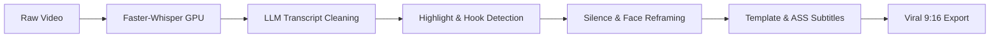

# ClipForge ⚡

<p align="center">
  <strong>Local AI Auto-Clipper & Short-Form Video Generator</strong><br>
  <em>Turn long-form videos, podcasts, and speeches into viral, platform-ready 9:16 vertical clips.</em>
</p>

<p align="center">
  
  
  
  
  
</p>

---

## 📖 Overview

**ClipForge** is a fully automated, local video-clipping engine that processes long-form videos and produces high-retention short clips tailored for **TikTok, Instagram Reels, YouTube Shorts, and X**.

It operates completely locally on your hardware, combining fast GPU transcription, intelligent LLM highlight detection, face-tracking reframing, and sub-pixel ASS subtitle rendering.



---

## ✨ Features

- 🌐 **Direct YouTube & Web Video Import**: Paste any YouTube link, Short, or web video URL to download and convert it directly into ClipForge's local processing pipeline.
- 🚀 **GPU-Accelerated Transcription**: Word-level timestamps powered by `faster-whisper` with automatic CUDA DLL preloading (compatible with RTX 30, 40, and 50-series GPUs).
- 🧹 **Confidence-Based Transcript Cleaning**: Fixes phonetic mishearings and audio artifacts using Whisper's per-word probability scores.
- 🎯 **Multi-Source Highlight Detection**:
  - **Local LLM (Ollama)**: Scores candidate clips by hook strength, virality, and emotional resonance.
  - **Email Automation**: Dispatches transcripts to remote AI agents and ingests approved selections via IMAP.
  - **Direct JSON Upload**: Ingests external highlight payloads preserving 100% of candidate timestamps and hooks.
- 📐 **Smart Speaker-Follow Reframing**: Keeps speakers centered when cropping 16:9 widescreen footage into 9:16 vertical format.
- 🎨 **Dynamic Template Engine**:
  - Full-screen 9:16 with top safe-zone hook titles and bottom captions.
  - Opaque or outlined typography (e.g. solid black text with crisp white letter outlines).
  - Letterbox, square-band, and custom layout presets.
- 🔍 **Style Lab & AI Style Explorer**: Vision-model evaluation (Qwen2.5-VL) to automatically test, score, and select the best visual style.
- 🔔 **Real-Time Web UI & Notifications**: Modern Starlette web dashboard with live logs, review cards, and optional Telegram bot progress alerts.

---

## ⚡ Quick Start

### 1. Prerequisites
- **Python 3.11+ / 3.12**
- **[FFmpeg](https://www.gyan.dev/ffmpeg/builds/)** on your system `PATH`.
- *(Optional)* **[Ollama](https://ollama.com/)** for local LLM highlight selection (`ollama pull qwen2.5:7b` or `llama3.2`).
- *(Optional)* NVIDIA GPU with CUDA drivers for 10x faster transcription.

### 2. Installation

```powershell
# Clone repository
git clone https://github.com/literallyeverything22-ux/Clipforge.git
cd Clipforge

# Create virtual environment
python -m venv .venv
.\.venv\Scripts\activate

# Install dependencies
pip install -r requirements.txt
```

### 3. Run

Simply double-click **`run.bat`** (or execute in PowerShell):

```powershell
.\run.bat
```

Open your browser at **`http://localhost:8600`** to access the ClipForge Studio.

---

## 🖥️ Web UI & Workflow

1. **Campaigns & Source**: Upload your video or select existing footage from the campaign manager.
2. **Analyze**: Transcribe audio and generate AI highlight candidates.
3. **Review & Approve**: Fine-tune clip start/end times, edit hook headlines, and preview candidate cuts.
4. **Style Lab**: Choose or customize subtitle fonts, sizes, colors, and layout positioning.
5. **Export**: Render final clips with subtitles, background music, and optional b-roll.

---

## 💻 Command Line Interface (CLI)

ClipForge also features a complete CLI:

```powershell
# Download video directly from YouTube / web URL
python main.py download "https://www.youtube.com/watch?v=..."

# Transcribe and analyze a video (or pass a URL directly!)
python main.py analyze input/my_video.mp4

# Run highlight selection via local Ollama
python main.py select my_video --model qwen2.5:7b

# Export clips with a specific template
python main.py export my_video --template full_screen

# Launch AI style exploration
python main.py explore-style my_video --brief "clean dark look"
```

---

## 🎨 Templates

Templates are configured via simple JSON files in the `templates/` directory:

| Template | Description | Text Styling |
|---|---|---|
| **`full_screen.json`** | Full 9:16 frame (1080x1920) with speaker-follow crop. | Black text with white letter outline on top hook and bottom captions. |
| **`square_captioned.json`** | Centered square video with letterbox bands. | Vibrant gradient captions with drop shadow and title card. |
| **`abu_lahya.json`** | Signature creator layout. | Custom band geometry and themed caption highlights. |

---

## ⚙️ Configuration

Key configuration parameters in `config.json`:

```json
{
  "llm_model": "qwen2.5:7b",
  "whisper_model": "small",
  "whisper_device": "cuda",
  "llm_max_clips": 10,
  "safe_top": 70,
  "safe_bottom": 300,
  "default_template": "full_screen"
}
```

---

## 📁 Project Structure

```
Clipforge/
├── assets/fonts/        # Bundled open-source typography (Poppins, Bebas Neue, etc.)
├── docs/                # Architecture diagrams and system maps
├── src/                 # Core pipeline modules
│   ├── apply_template.py   # Subtitle & filter rendering engine
│   ├── audio_processor.py  # VAD silence detection & audio processing
│   ├── campaigns.py        # Campaign data persistence
│   ├── text_layout.py      # Sub-pixel safe-zone text layout engine
│   ├── transcribe.py       # Faster-Whisper GPU transcription & CUDA loader
│   ├── video_reframer.py   # 9:16 smart crop and face reframing
│   └── ...
├── templates/           # Visual layout and styling templates (JSON)
├── tests/               # Automated test suite
├── web/                 # Web UI frontend (HTML/CSS/JS)
├── guide.md             # End-user step-by-step instructions
├── main.py              # CLI entry point
├── requirements.txt     # Python dependencies
├── run.bat              # 1-Click Windows launcher
├── server.py            # Starlette backend API & static server
└── start_clipforge.bat  # Process management & startup script
```

---

## 📄 License

Distributed under the **MIT License**. See `LICENSE` for more information.
