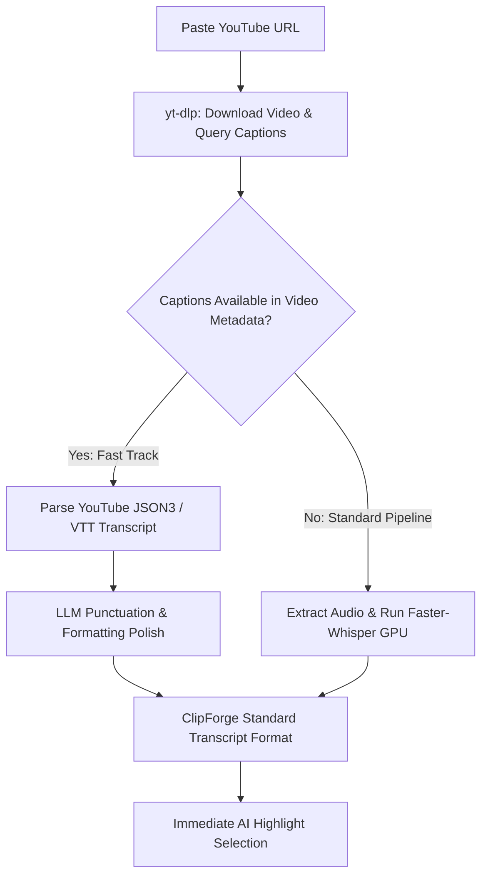

# ⚡ YouTube Fast-Track Transcript Plan: Instant AI Clipping via Subtitle Ingestion

This document outlines the architecture, pipeline design, and implementation strategy for **skipping local Whisper transcription** when importing YouTube videos by fetching YouTube's pre-computed captions directly through `yt-dlp`.

---

## 🎯 Executive Summary

* **Current Workflow**: Every imported video undergoes full GPU/CPU transcription via `faster-whisper`. For a 60-minute video, this takes **2 to 5 minutes** on an NVIDIA GPU (or 10–20 minutes on CPU).
* **Fast-Track Workflow**: For YouTube videos with existing manual or auto-generated captions, `yt-dlp` downloads the transcript alongside the video in **under 2 seconds**.
* **Speedup**: **~98% reduction in initial processing time**, allowing users to jump directly to AI highlight detection almost instantly.

---

## 💡 Concept & The "Express Lane" Analogy

Think of this like an **Express Lane** at an airport:
* **The Express Lane (YouTube Captions)**: If the passenger already has their boarding pass ready (YouTube already listened to and transcribed the audio on their cloud servers), we scan it in 2 seconds and let them through directly to the highlight selector.
* **The Full Check-in Desk (Whisper AI)**: If there is no boarding pass (uploaded local file or video without subtitles), ClipForge seamlessly routes them to our local Whisper AI engine for full transcription.



---

## 🔍 Technical Deep-Dive

### 1. YouTube Subtitle Formats & Word-Level Timing

YouTube stores captions in multiple formats:

| Format | Timing Level | Description |
|---|---|---|
| **`json3` (Recommended)** | **Word & Segment** | YouTube's internal format containing per-word start offsets (`tOffsetMs`) and durations. This preserves **word-by-word animated captions**. |
| **`vtt` / `srt`** | **Sentence / Line** | Standard subtitle blocks (3–7 words per line). Fast and universal, but requires word-timing interpolation for karaoke effects. |
| **Manual Creator Subs** | **High Quality** | Creator-provided transcripts with perfect spelling, punctuation, and terminology. |

### 2. Punctuation & Capitalization Layer
YouTube auto-generated subtitles often lack punctuation and capitalization. ClipForge will route the fast-track transcript through its existing [`clean_transcript.py`](file:///c:/Users/liter/Downloads/clipforge-source-fixed/clipforge-source/src/clean_transcript.py) module using local Ollama (`qwen2.5:7b` / `llama3.2`) to restore sentence boundaries and punctuation in seconds.

---

## ⚖️ Trade-off Matrix

| Metric | Fast-Track (YouTube Captions) | Local GPU (Faster-Whisper) |
|---|---|---|
| **Processing Time (60m video)** | **~2 seconds** ⚡ | 2–5 minutes |
| **Hardware Requirement** | Zero GPU / CPU load | Dedicated NVIDIA GPU recommended |
| **Word-Level Precision** | High (in `json3`) / Interpolated (in `vtt`) | Ultra-High (exact acoustic alignment) |
| **Spelling Accuracy (Technical terms)** | Good (YouTube ASR) | Excellent (Whisper `large-v3` / `small`) |
| **Local File Compatibility** | YouTube URLs only | Works on any video / audio file |

---

## 🛠️ Implementation Blueprint

### Phase 1: Downloader Subtitle Extraction (`src/downloader.py`)
Configure `yt-dlp` options to fetch subtitles alongside the video stream:
```python
ydl_opts = {
    "writesubtitles": True,
    "writeautomaticsub": True,
    "subtitleslangs": ["en.*", "en"],
    "subtitlesformat": "json3/vtt",
    # ... video download options
}
```

### Phase 2: Transcript Parser (`src/youtube_transcript.py`)
Create a converter that transforms YouTube's `json3` / `vtt` output into ClipForge's standardized transcript schema (`data/transcripts/<video_id>_transcript.json`):
```json
{
  "video_id": "sample_video",
  "source": "youtube_captions",
  "segments": [
    {
      "start": 0.0,
      "end": 3.42,
      "text": "Welcome back to the podcast.",
      "words": [
        {"word": "Welcome", "start": 0.0, "end": 0.45, "probability": 0.98},
        {"word": "back", "start": 0.46, "end": 0.85, "probability": 0.99}
      ]
    }
  ]
}
```

### Phase 3: Web UI Controls & Feedback (`web/`)
1. **Source Card Badge**: Show a `⚡ Fast-Track Ready` badge on YouTube-imported videos that have instant transcripts.
2. **User Preference Toggle**: Add an option in the Settings panel:
   * `[x] Prefer Instant YouTube Transcripts (Recommended - 98% faster)`
   * `[ ] Always Re-transcribe with Local GPU Whisper (Maximum precision)`

### Phase 4: Fallback & Automation Integration
* If YouTube subtitles are missing, the pipeline automatically falls back to standard Whisper transcription with zero user intervention required.
* The CLI `python main.py analyze <url>` automatically detects if a fast-track transcript was saved and skips stage 1 (`transcribe`).

---

## 📋 Status & Next Steps

* **Current Status**: Documented & Architected.
* **Prerequisites**: `yt-dlp>=2024.0.0` (already installed in `.venv`).
* **Ready for Implementation**: When requested, this feature can be rolled out seamlessly without disrupting existing file upload or local transcription workflows.
