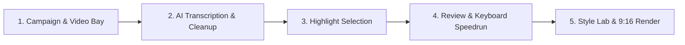

# ClipForge Studio User Guide 🎬

Welcome to **ClipForge Studio** — an automated local AI video clipper and creative production suite that transforms long-form videos (podcasts, speeches, interviews, streams) into viral vertical clips (9:16) for TikTok, YouTube Shorts, Instagram Reels, and Twitter.

---

## 🚀 Quick Start (1-Click Run)

1. **Prerequisites**:
   - Ensure **[FFmpeg](https://www.gyan.dev/ffmpeg/builds/)** is installed and accessible from your terminal (`ffmpeg -version`).
   - If using local AI highlight selection, ensure **[Ollama](https://ollama.com/)** is running (`ollama serve`).

2. **Launch ClipForge**:
   - Double-click **`run.bat`** (or `start_clipforge.bat`) in this folder.
   - ClipForge will automatically start the local backend server and open the Web UI at **`http://localhost:8600`** in your default browser.

3. **Stop ClipForge**:
   - Press `Ctrl + C` in the terminal window, then type `Y` to stop the server.

---

## ⚡ UI/UX Pro Max Studio Highlights

- **Dark Studio Aesthetics**: OLED-grade contrast with glowing status badges, sleek glassmorphism, and responsive layout.
- **Top Studio Breadcrumbs & Search**: Quickly search and filter campaign bays in real time with live campaign analytics counters.
- **Visual Funnel Progress Strip**: 6-stage interactive status tracker (`Sources` → `Transcribed` → `Analysed` → `Candidates` → `Approved` → `Exported`).
- **Review Speedrun Shortcuts**:
  - `A`: Toggle Approve candidate clip
  - `R`: Toggle Reject candidate clip
  - `Space`: Toggle instant clip video preview
  - `S` or `Ctrl + S`: Save review decisions
- **AI Visual Style Explorer**: Test multiple color, font, and layout combinations with automated AI scoring.
- **Floating Telemetry Runbar**: Live real-time task status dock with progress bar and collapsible developer terminal logs.

---

## 📋 Step-by-Step Workflow

### 1. Create a Campaign Bay & Add Videos (Upload or Paste Link)
- Open the Web UI at `http://localhost:8600`.
- Create a new campaign bay or select an existing one.
- **Option A (Paste Video URL)**: Paste any YouTube link, YouTube Short, TikTok, or web video URL into the **Import Video** box and click **Import**. ClipForge will download and convert it automatically.
- **Option B (Local File)**: Drag & drop your MP4/MOV video file directly into the upload dropzone.
- *(Optional)* Attach a creator brief (PDF, DOCX, TXT, MD) to steer AI topic selection and brand safety rules.

### 2. Transcribe & Clean Audio
- Click **Find Highlights** on any uploaded video card.
- ClipForge uses GPU-accelerated **Faster-Whisper** to transcribe the video with accurate word-level timestamps.
- An intelligent LLM cleanup layer automatically fixes phonetic mishearings and punctuation based on Whisper's confidence scores.

### 3. Generate or Ingest Highlights
You have three flexible ways to get highlight clips:
- **Local AI (Ollama)**: Automatically analyzes the transcript and scores candidate clips based on virality, engagement, and hooks.
- **Email Dispatch Pipeline**: Dispatches the transcript to an email agent and automatically ingests highlight picks upon reply.
- **Direct JSON Ingestion**: Click *Upload JSON* to attach an externally generated highlights file.

### 4. Review & Speedrun Candidate Clips
- Go to the **Review** tab to see all proposed clips sorted by AI virality score.
- Fine-tune start/end timestamps and edit custom hook headlines.
- Use keyboard shortcuts (`A` to approve, `R` to reject, `Space` to preview).
- Click **Save Decisions** to persist your curated selections.

### 5. Choose Style Template & Export
- In the **Exports** or **Settings** tab, choose your target template:
  - **Full Screen (9:16)**: Video fills the vertical canvas with intelligent speaker face-tracking and high-contrast captions.
  - **Square Captioned**: Centered square video with custom colored header and caption bands.
  - **Abu Lahya / Custom**: Distinctive creator branding layout.
- Click **Render Approved** to generate finished MP4 vertical clips with burned-in animated subtitles and optional background music.

---

## ⚡ 15 Quick Start Presets & Dynamic Karaoke Animations

ClipForge now comes equipped with **15 authentic short-form presets** with speech-aware line breaking, active-word karaoke highlighting, word-pop scaling, and timed hook dismissal:

| # | Preset | Category | Best For | Typography & Animation |
|---|---|---|---|---|
| 1 | **Creator Default** | Clean | All viral clips, podcasts | Montserrat ExtraBold (70px), Cyan `#38BDF8` pop, White hook pill box |
| 2 | **Clean Cut** | Clean | General clips, interviews | Poppins Bold (66px), Aqua `#22D3EE` pop, Crisp contrast |
| 3 | **Karaoke** | Dynamic | High energy, podcasts | Montserrat ExtraBold (72px), Bright green `#00E676` pop (1.14x scale) |
| 4 | **Podcast Pro** | Professional | Conversational podcasts | Kanit Bold (68px), Amber `#F59E0B` active word, Slate hook pill |
| 5 | **Beast Mode** | Dynamic | Motivation, fitness | Archivo Black (74px), Electric Yellow `#FFE600` pop (1.15x scale) |
| 6 | **Grow** | Creator | Finance, business, startups | Barlow Condensed Bold (74px), Emerald `#10B981` highlight pop |
| 7 | **Minimal** | Clean | Tech, calm interviews | Poppins Bold (56px), Crisp white `#F8FAFC`, Smooth subtitle fade |
| 8 | **Storyteller** | Emotional | Personal memoirs, drama | Saira Condensed Bold (68px), Dramatic Rose `#F43F5E` emphasis |
| 9 | **Hype** | Dynamic | Gaming, sports, reactions | Anton ExtraBold (80px), Hot Pink `#FF0055` pop (1.16x scale) |
| 10 | **Deep Diver** | Professional | Science, documentaries | Lato Bold (58px), Cyan `#38BDF8` technical keyword emphasis |
| 11 | **Cinematic** | Emotional | Documentary, filmmaking | Lato Bold (54px), Subtle slate shadow, Wide breathing room |
| 12 | **News Flash** | Professional | News, facts, stats | Archivo Black (66px), Red `#EF4444` keyword emphasis & top red banner |
| 13 | **Baby Steps** | Creator | Beginner guides, coaching | Poppins Bold (64px), Warm Amber `#FBBF24` highlight pop |
| 14 | **Soft Landing** | Emotional | Lifestyle, wellness | Poppins Bold (60px), Pastel Pink `#FBCFE8` highlight fade |
| 15 | **Meme Pop** | Dynamic | Comedy, funny clips | Bangers ExtraBold (76px), Yellow `#FACC15` pop with bounce effect |

---

## 🎨 Minimal Quick Start Style Studio (Clean, Preview-First Workspace)

ClipForge features a streamlined, creator-focused Visual Style Studio modeled after modern clipping products (Klap, OpusClip):

**Choose a preset → Preview it on an enlarged video canvas → Make optional tweaks → Apply → Done.**

1. **Large Dominating Video Preview (Left / Center Stage)**:
   - **Enlarged Snapshot Size**: The 9:16 video snapshot is significantly enlarged (~40-50% bigger) so subtitle typography, word-pop highlights, and facial framing are crisp and easily readable without squinting.
   - **Compact Header Controls**:
     - `Preview`: Quick aspect ratio dropdown (`9:16 Recommended`, `1:1`, `16:9`).
     - `Safe zone ○`: Subtle platform guide overlay (OFF by default for an uncluttered view).
     - `Single line`: Auto-fits text to guarantee words never overflow safe screen margins.
   - **1-Click Auto-Fix**: If text ever drifts outside safe platform bounds, a subtle warning pill appears with **`[ Fix automatically ]`** to instantly snap text safely back inside margins.
   - **Direct Manipulation**: Click, drag, and resize text overlays right on the video frame using 4 corner bounding handles.
   - **Lightweight Timeline & Filmstrip**: Play/pause, scrub with the timeline slider, or click keyframe filmstrip thumbnails to preview different video scenes.

2. **Quick Start Presets (Primary Right Panel)**:
   - Displays the top **6 core presets** with live animated word-pop previews:
     1. `Creator Default`
     2. `Clean Cut`
     3. `Karaoke`
     4. `Beast Mode`
     5. `Podcast Pro`
     6. `Minimal`
   - Click any card to apply the preset instantly to the video preview.
   - Click **`View all 15 presets →`** to open the full modal library with category filters and detailed recommendations.

3. **Customize Accordions (Clean & Tucked Away)**:
   - Kept compact with only one section open at a time:
     - **Captions ›**: Font, size slider, text/highlight/outline colors, animation style (`Word Pop`, `Smooth Fade`, `Bounce`), plus collapsible `Advanced typography`.
     - **Position ›**: Quick **3×3 visual position grid** (`↖`, `↑`, `↗`, `←`, `•`, `→`, `↙`, `↓`, `↘`), alignment shortcuts, plus collapsible precision X/Y sliders.
     - **Hook ›**: On/off toggle switch, hook headline text with live character counter, style preset (`Pill`, `Banner`, `Clean`), position, and auto-fade duration.
     - **More ›**: Social handle / watermark, channel branding, and CTAs.

4. **Streamlined Action Bar**:
   - Two clear main actions: **`[ Apply to this clip ]`** and **`[ Apply to all clips ]`**.
   - Secondary actions (`Reset style`, `Duplicate style`, `Copy to all clips`, `Refresh frame`) are neatly organized in the top **`⋯`** menu.

5. **Keyboard Shortcuts**:
   - `Escape`: Deselect current layer or close the studio workspace.
   - `Arrow Keys`: Nudge active text by 1% in any direction (`Shift + Arrow` for 4% faster nudge).
   - `Ctrl + Z`: Undo last change.
   - `Ctrl + Y` (or `Ctrl + Shift + Z`): Redo last change.

---

## ⚙️ Configuration (`config.json` & `.env`)

- **`config.json`**:
  - `llm_model`: Local Ollama model name (e.g., `llama3.2`, `qwen2.5:7b`).
  - `whisper_model`: Whisper model size (`base`, `small`, `medium`, `large-v3`).
  - `whisper_device`: `"cuda"` for NVIDIA GPU acceleration or `"cpu"`.
  - `safe_top` / `safe_bottom`: Canvas margins for platform UI chrome.
- **`.env`**:
  - Optional API keys for stock b-roll (`PEXELS_API_KEY`, `PIXABAY_API_KEY`).
  - Optional Telegram bot tokens for mobile progress notifications.

---

## 🛠️ Troubleshooting

- **FFmpeg not recognized**:
  - Download FFmpeg Essentials from Gyan.dev, extract to `C:\ffmpeg`, and add `C:\ffmpeg\bin` to your Windows System `PATH` environment variable.
- **CUDA / GPU not used**:
  - Ensure you have the latest NVIDIA drivers installed. ClipForge includes pre-configured CUDA runtime DLLs for RTX 30/40/50-series GPUs.
- **Port 8600 busy**:
  - `run.bat` automatically detects and frees any stale background process on port 8600.

