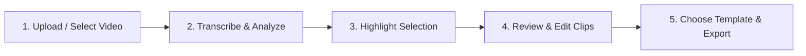

# ClipForge User Guide 🎬

Welcome to **ClipForge** — an automated local AI video clipper that transforms long-form videos (podcasts, speeches, interviews, streams) into viral vertical clips (9:16) for TikTok, YouTube Shorts, Instagram Reels, and Twitter.

---

## 🚀 Quick Start (1-Click Run)

1. **Prerequisites**:
   - Ensure **[FFmpeg](https://www.gyan.dev/ffmpeg/builds/)** is installed and accessible from your terminal (`ffmpeg -version`).
   - If using local LLM highlight selection, ensure **[Ollama](https://ollama.com/)** is running (`ollama serve`).

2. **Launch ClipForge**:
   - Double-click **`run.bat`** (or `start_clipforge.bat`) in this folder.
   - ClipForge will automatically start the local backend server and open the Web UI at **`http://localhost:8600`** in your default browser.

3. **Stop ClipForge**:
   - Press `Ctrl + C` in the terminal window, then type `Y` to stop the server.

---

## 📋 Step-by-Step Workflow

### 1. Create a Campaign & Select Video
- Open the Web UI at `http://localhost:8600`.
- Create a new campaign or choose an existing campaign.
- Upload your MP4/MOV video file or place it inside your campaign's `input/` folder.

### 2. Transcribe & Clean Transcript
- Click **Analyze**.
- ClipForge uses GPU-accelerated **Faster-Whisper** to transcribe the video with accurate word-level timestamps.
- An intelligent LLM cleanup layer automatically fixes phonetic mishearings and punctuation based on Whisper's confidence scores.

### 3. Generate or Upload Highlights
You have three flexible ways to get highlight clips:
- **Local AI (Ollama)**: Automatically analyzes the transcript and scores candidate clips based on virality, engagement, and hooks.
- **Email Pipeline**: Sends the transcript to an email agent and ingests the highlight response.
- **Manual Upload**: Upload a JSON highlights file directly. ClipForge ingests 100% of candidate clips with custom timestamps and hook titles.

### 4. Review & Customize Clips
- Head to the **Review** tab to see all proposed clips.
- Edit clip start/end timestamps and custom hook headlines.
- Approve the clips you want to export or reject unwanted ones.
- Preview raw cuts before full rendering.

### 5. Choose Style Template & Export
- Select your target visual template:
  - **Full Screen (9:16)**: Video covers the full vertical frame (with speaker face-tracking), top hook title, and bottom subtitles with clean high-contrast styling.
  - **Square Captioned**: Square video centered with top hook and bottom captions.
  - **Custom / Style Lab**: Design your own layout and typography templates.
- Click **Export** to generate finished MP4 clips complete with burned-in subtitles, optional background music, and b-roll.

---

## 🎨 Templates & Customization

Templates are stored as simple JSON files in the `templates/` folder:

| Template | Aspect Ratio | Description |
|---|---|---|
| `full_screen.json` | 9:16 | Full frame 1080x1920 with speaker tracking, black text with white outline, top hook title, and bottom captions. |
| `square_captioned.json` | 9:16 | Letterbox/square video format with custom colored header and caption bands. |
| `abu_lahya.json` | 9:16 | Distinctive branding layout with speaker tracking and bottom caption styling. |

To edit fonts, font sizes, colors, or positioning, edit the JSON file in `templates/` or use the **Style Lab** tab in the web UI.

---

## ⚙️ Configuration (`config.json` & `.env`)

- **`config.json`**:
  - `llm_model`: Local Ollama model name (e.g., `llama3.2`, `qwen2.5:7b`).
  - `whisper_model`: Whisper model size (`base`, `small`, `medium`, `large-v3`).
  - `whisper_device`: `"cuda"` for NVIDIA GPU acceleration or `"cpu"`.
  - `safe_top` / `safe_bottom`: Canvas margins for platform UI chrome.
- **`.env`**:
  - Optional API keys for stock b-roll (`PEXELS_API_KEY`, `PIXABAY_API_KEY`).
  - Optional Telegram bot tokens for mobile progress notifications.

---

## 🛠️ Troubleshooting

- **FFmpeg not recognized**:
  - Download FFmpeg Essentials from Gyan.dev, extract to `C:\ffmpeg`, and add `C:\ffmpeg\bin` to your Windows System `PATH` environment variable.
- **CUDA / GPU not used**:
  - Ensure you have the latest NVIDIA drivers installed. ClipForge includes pre-configured CUDA runtime DLLs for RTX 30/40/50-series GPUs.
- **Port 8600 busy**:
  - `run.bat` will automatically detect and clean up any stale ClipForge background process on port 8600.
