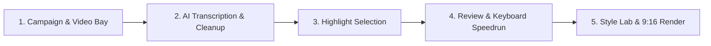

# ClipForge Studio User Guide 🎬

Welcome to **ClipForge Studio** — an automated local AI video clipper and creative production suite that transforms long-form videos (podcasts, speeches, interviews, streams) into viral vertical clips (9:16) for TikTok, YouTube Shorts, Instagram Reels, and Twitter.

---

## 🚀 Quick Start (1-Click Run)

1. **Prerequisites**:
   - Ensure **[FFmpeg](https://www.gyan.dev/ffmpeg/builds/)** is installed and accessible from your terminal (`ffmpeg -version`).
   - If using local AI highlight selection, ensure **[Ollama](https://ollama.com/)** is running (`ollama serve`).

2. **Launch ClipForge**:
   - Double-click **`run.bat`** (or `start_clipforge.bat`) in this folder.
   - ClipForge will automatically start the local backend server and open the Web UI at **`http://localhost:8600`** in your default browser.

3. **Stop ClipForge**:
   - Press `Ctrl + C` in the terminal window, then type `Y` to stop the server.

---

## ⚡ UI/UX Pro Max Studio Highlights

- **Dark Studio Aesthetics**: OLED-grade contrast with glowing status badges, sleek glassmorphism, and responsive layout.
- **Top Studio Breadcrumbs & Search**: Quickly search and filter campaign bays in real time with live campaign analytics counters.
- **Visual Funnel Progress Strip**: 6-stage interactive status tracker (`Sources` → `Transcribed` → `Analysed` → `Candidates` → `Approved` → `Exported`).
- **Review Speedrun Shortcuts**:
  - `A`: Toggle Approve candidate clip
  - `R`: Toggle Reject candidate clip
  - `Space`: Toggle instant clip video preview
  - `S` or `Ctrl + S`: Save review decisions
- **AI Visual Style Explorer**: Test multiple color, font, and layout combinations with automated AI scoring.
- **Floating Telemetry Runbar**: Live real-time task status dock with progress bar and collapsible developer terminal logs.

---

## 📋 Step-by-Step Workflow

### 1. Create a Campaign Bay & Add Videos (Upload or Paste Link)
- Open the Web UI at `http://localhost:8600`.
- Create a new campaign bay or select an existing one.
- **Option A (Paste Video URL)**: Paste any YouTube link, YouTube Short, TikTok, or web video URL into the **Import Video** box and click **Import**. ClipForge will download and convert it automatically.
- **Option B (Local File)**: Drag & drop your MP4/MOV video file directly into the upload dropzone.
- *(Optional)* Attach a creator brief (PDF, DOCX, TXT, MD) to steer AI topic selection and brand safety rules.

### 2. Transcribe & Clean Audio
- Click **Find Highlights** on any uploaded video card.
- ClipForge uses GPU-accelerated **Faster-Whisper** to transcribe the video with accurate word-level timestamps.
- An intelligent LLM cleanup layer automatically fixes phonetic mishearings and punctuation based on Whisper's confidence scores.

### 3. Generate or Ingest Highlights
You have three flexible ways to get highlight clips:
- **Local AI (Ollama)**: Automatically analyzes the transcript and scores candidate clips based on virality, engagement, and hooks.
- **Email Dispatch Pipeline**: Dispatches the transcript to an email agent and automatically ingests highlight picks upon reply.
- **Direct JSON Ingestion**: Click *Upload JSON* to attach an externally generated highlights file.

### 4. Review & Speedrun Candidate Clips
- Go to the **Review** tab to see all proposed clips sorted by AI virality score.
- Fine-tune start/end timestamps and edit custom hook headlines.
- Use keyboard shortcuts (`A` to approve, `R` to reject, `Space` to preview).
- Click **Save Decisions** to persist your curated selections.

### 5. Choose Style Template & Export
- In the **Exports** or **Settings** tab, choose your target template:
  - **Full Screen (9:16)**: Video fills the vertical canvas with intelligent speaker face-tracking and high-contrast captions.
  - **Square Captioned**: Centered square video with custom colored header and caption bands.
  - **Abu Lahya / Custom**: Distinctive creator branding layout.
- Click **Render Approved** to generate finished MP4 vertical clips with burned-in animated subtitles and optional background music.

---

## ⚡ 15 Quick Start Presets & Dynamic Karaoke Animations

ClipForge now comes equipped with **15 authentic short-form presets** with speech-aware line breaking, active-word karaoke highlighting, word-pop scaling, and timed hook dismissal:

| # | Preset | Category | Best For | Typography & Animation |
|---|---|---|---|---|
| 1 | **Creator Default** | Clean | All viral clips, podcasts | Montserrat ExtraBold (70px), Cyan `#38BDF8` pop, White hook pill box |
| 2 | **Clean Cut** | Clean | General clips, interviews | Poppins Bold (66px), Aqua `#22D3EE` pop, Crisp contrast |
| 3 | **Karaoke** | Dynamic | High energy, podcasts | Montserrat ExtraBold (72px), Bright green `#00E676` pop (1.14x scale) |
| 4 | **Podcast Pro** | Professional | Conversational podcasts | Kanit Bold (68px), Amber `#F59E0B` active word, Slate hook pill |
| 5 | **Beast Mode** | Dynamic | Motivation, fitness | Archivo Black (74px), Electric Yellow `#FFE600` pop (1.15x scale) |
| 6 | **Grow** | Creator | Finance, business, startups | Barlow Condensed Bold (74px), Emerald `#10B981` highlight pop |
| 7 | **Minimal** | Clean | Tech, calm interviews | Poppins Bold (56px), Crisp white `#F8FAFC`, Smooth subtitle fade |
| 8 | **Storyteller** | Emotional | Personal memoirs, drama | Saira Condensed Bold (68px), Dramatic Rose `#F43F5E` emphasis |
| 9 | **Hype** | Dynamic | Gaming, sports, reactions | Anton ExtraBold (80px), Hot Pink `#FF0055` pop (1.16x scale) |
| 10 | **Deep Diver** | Professional | Science, documentaries | Lato Bold (58px), Cyan `#38BDF8` technical keyword emphasis |
| 11 | **Cinematic** | Emotional | Documentary, filmmaking | Lato Bold (54px), Subtle slate shadow, Wide breathing room |
| 12 | **News Flash** | Professional | News, facts, stats | Archivo Black (66px), Red `#EF4444` keyword emphasis & top red banner |
| 13 | **Baby Steps** | Creator | Beginner guides, coaching | Poppins Bold (64px), Warm Amber `#FBBF24` highlight pop |
| 14 | **Soft Landing** | Emotional | Lifestyle, wellness | Poppins Bold (60px), Pastel Pink `#FBCFE8` highlight fade |
| 15 | **Meme Pop** | Dynamic | Comedy, funny clips | Bangers ExtraBold (76px), Yellow `#FACC15` pop with bounce effect |

---

## 🎨 Visual Canvas & Style Studio (Professional Video-Text Editor)

ClipForge features a full-screen, professional video-text studio modeled after CapCut and Premiere:

1. **Center Stage & Direct Canvas Interaction**:
   - **Click & Select**: Click either the Hook Headline or Subtitles directly on the 9:16 video frame to select it.
   - **Drag Anywhere**: Grab and move text overlays anywhere on the video frame. Positions are stored as normalized coordinates (`0.0` to `1.0`), ensuring identical placement in preview and rendered video.
   - **Corner Drag Resizing**: Click and drag any of the 4 corner handles on the selection bounding box to interactively scale font size up or down.
   - **Floating Micro-Toolbar**: Appears right above or below the selected layer for lightning-fast tweaks:
     - `Aa`: Toggle uppercase / titlecase.
     - `−` / `+`: Step font size by 4px.
     - Center / Align: Cycle Left, Center, and Right alignment.
     - More: Instantly focus the Right Inspector panel.
   - **Interactive Safe-Zone Detection**: Toggle `Safe Zones` to reveal TikTok/Reels platform chrome boundaries. If any text element drifts into unsafe margins, an instant warning badge alerts you.
   - **Zoom Dock**: Easily zoom in (`+`), zoom out (`−`), or reset (`Fit` / `100%`) without disrupting coordinate calculations.

2. **Video Timeline & Filmstrip Scrubbing**:
   - Scrub through your clip using the bottom timeline slider or click any of the 7 snapshot frames in the filmstrip row.
   - See how your text looks over different video scenes, face angles, and background lighting.

3. **Left Panel (Layers & Quick Actions)**:
   - **Clip Info Card**: Shows current clip thumbnail, duration, speaker, and title.
   - **Aspect Ratio Selector**: Switch between `9:16` (Vertical), `1:1` (Square), and `16:9` (Landscape).
   - **Layers List**: Quickly select `Hook Headline` or `Subtitles` and toggle layer visibility with the eye icon.
   - **Quick Actions**:
     - `Duplicate Style`: Instantly copies typography and colors from Hook to Subtitles or vice-versa without changing text words.
     - `Copy to All Clips`: Applies current layout and style to every clip in the campaign.
     - `Reset Canvas`: Restores factory positions and default preset.
     - `Refresh Frame`: Re-extracts the current video frame via FFmpeg.

4. **Right Contextual Inspector**:
   - **Quick Start Presets Bar**: 1-click styling with category filter pills (`All`, `Clean`, `Dynamic`, `Pro`, `Emotional`, `Creator`).
   - **Live Animated Preview Cards**: Each card displays a dynamic animated simulation of `"THE FUTURE IS HERE"` with the preset's actual font, outline stroke, and active-word pop!
   - **View All Presets Modal**: Click **View All (15)** to browse the full library in a spacious 3-column modal with "Best for" tags and 1-click apply.
   - **Contextual Typography & Color**: Dynamically switches between Hook Headline controls and Subtitles controls based on what layer is active. Includes live character counter (`/60`), Font, Weight, Size, Color pickers, Outline width, Letter-spacing, and Line-height.
   - **Single-Line Dynamic Auto-Fit**: Guarantees hook headlines and subtitles never wrap onto multiple lines or overflow platform margins by dynamically calculating safe font sizes.
   - **Position & Alignment**: Left, Center, and Right alignment pills plus precision X and Y percentage sliders.

5. **Keyboard Shortcuts**:
   - `Escape`: Deselect current layer or close the studio workspace.
   - `Arrow Keys`: Nudge active text by 1% in any direction (`Shift + Arrow` for 4% faster nudge).
   - `Ctrl + Z`: Undo last change.
   - `Ctrl + Y` (or `Ctrl + Shift + Z`): Redo last change.

---

## ⚙️ Configuration (`config.json` & `.env`)

- **`config.json`**:
  - `llm_model`: Local Ollama model name (e.g., `llama3.2`, `qwen2.5:7b`).
  - `whisper_model`: Whisper model size (`base`, `small`, `medium`, `large-v3`).
  - `whisper_device`: `"cuda"` for NVIDIA GPU acceleration or `"cpu"`.
  - `safe_top` / `safe_bottom`: Canvas margins for platform UI chrome.
- **`.env`**:
  - Optional API keys for stock b-roll (`PEXELS_API_KEY`, `PIXABAY_API_KEY`).
  - Optional Telegram bot tokens for mobile progress notifications.

---

## 🛠️ Troubleshooting

- **FFmpeg not recognized**:
  - Download FFmpeg Essentials from Gyan.dev, extract to `C:\ffmpeg`, and add `C:\ffmpeg\bin` to your Windows System `PATH` environment variable.
- **CUDA / GPU not used**:
  - Ensure you have the latest NVIDIA drivers installed. ClipForge includes pre-configured CUDA runtime DLLs for RTX 30/40/50-series GPUs.
- **Port 8600 busy**:
  - `run.bat` automatically detects and frees any stale background process on port 8600.

