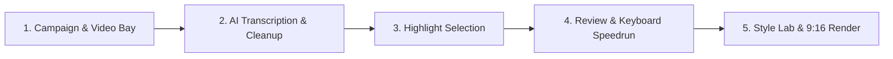

# ClipForge Studio User Guide 🎬

Welcome to **ClipForge Studio** — an automated local AI video clipper and creative production suite that transforms long-form videos (podcasts, speeches, interviews, streams) into viral vertical clips (9:16) for TikTok, YouTube Shorts, Instagram Reels, and Twitter.

---

## 🚀 Quick Start (1-Click Run)

1. **Prerequisites**:
   - Ensure **[FFmpeg](https://www.gyan.dev/ffmpeg/builds/)** is installed and accessible from your terminal (`ffmpeg -version`).
   - If using local AI highlight selection, ensure **[Ollama](https://ollama.com/)** is running (`ollama serve`).

2. **Launch ClipForge**:
   - Double-click **`run.bat`** (or `start_clipforge.bat`) in this folder.
   - ClipForge will automatically start the local backend server and open the Web UI at **`http://localhost:8600`** in your default browser.

3. **Stop ClipForge**:
   - Press `Ctrl + C` in the terminal window, then type `Y` to stop the server.

---

## ⚡ UI/UX Pro Max Studio Highlights

- **Dark Studio Aesthetics**: OLED-grade contrast with glowing status badges, sleek glassmorphism, and responsive layout.
- **Top Studio Breadcrumbs & Search**: Quickly search and filter campaign bays in real time with live campaign analytics counters.
- **Visual Funnel Progress Strip**: 6-stage interactive status tracker (`Sources` → `Transcribed` → `Analysed` → `Candidates` → `Approved` → `Exported`).
- **Review Speedrun Shortcuts**:
  - `A`: Toggle Approve candidate clip
  - `R`: Toggle Reject candidate clip
  - `Space`: Toggle instant clip video preview
  - `S` or `Ctrl + S`: Save review decisions
- **AI Visual Style Explorer**: Test multiple color, font, and layout combinations with automated AI scoring.
- **Floating Telemetry Runbar**: Live real-time task status dock with progress bar and collapsible developer terminal logs.

---

## 📋 Step-by-Step Workflow

### 1. Create a Campaign Bay & Add Videos (Upload or Paste Link)
- Open the Web UI at `http://localhost:8600`.
- Create a new campaign bay or select an existing one.
- **Option A (Paste Video URL)**: Paste any YouTube link, YouTube Short, TikTok, or web video URL into the **Import Video** box and click **Import**. ClipForge will download and convert it automatically.
- **Option B (Local File)**: Drag & drop your MP4/MOV video file directly into the upload dropzone.
- *(Optional)* Attach a creator brief (PDF, DOCX, TXT, MD) to steer AI topic selection and brand safety rules.

### 2. Transcribe & Clean Audio
- Click **Find Highlights** on any uploaded video card.
- ClipForge uses GPU-accelerated **Faster-Whisper** to transcribe the video with accurate word-level timestamps.
- An intelligent LLM cleanup layer automatically fixes phonetic mishearings and punctuation based on Whisper's confidence scores.

### 3. Generate or Ingest Highlights
You have three flexible ways to get highlight clips:
- **Local AI (Ollama)**: Automatically analyzes the transcript and scores candidate clips based on virality, engagement, and hooks.
- **Email Dispatch Pipeline**: Dispatches the transcript to an email agent and automatically ingests highlight picks upon reply.
- **Direct JSON Ingestion**: Click *Upload JSON* to attach an externally generated highlights file.

### 4. Review & Speedrun Candidate Clips
- Go to the **Review** tab to see all proposed clips sorted by AI virality score.
- Fine-tune start/end timestamps and edit custom hook headlines.
- Use keyboard shortcuts (`A` to approve, `R` to reject, `Space` to preview).
- Click **Save Decisions** to persist your curated selections.

### 5. Choose Style Template & Export
- In the **Exports** or **Settings** tab, choose your target template:
  - **Full Screen (9:16)**: Video fills the vertical canvas with intelligent speaker face-tracking and high-contrast captions.
  - **Square Captioned**: Centered square video with custom colored header and caption bands.
  - **Abu Lahya / Custom**: Distinctive creator branding layout.
- Click **Render Approved** to generate finished MP4 vertical clips with burned-in animated subtitles and optional background music.

---

## 🎨 Built-in Style Templates

Templates are stored as simple JSON files in the `templates/` folder:

| Template | Aspect Ratio | Description |
|---|---|---|
| `full_screen.json` | 9:16 | Full frame 1080x1920 with speaker tracking, high-contrast captions, top hook title, and clean subtitle animations. |
| `square_captioned.json` | 9:16 | Letterbox/square video format with custom colored header and caption bands. |
| `abu_lahya.json` | 9:16 | Distinctive branding layout with speaker tracking and bottom caption styling. |

## 🎨 Visual Canvas & CapCut-Style Layout Studio

You can visually position and style your hook and captions directly over video frames:

1. **Open Studio**: Click **"🎨 Layout & Style"** on any candidate clip card in the Review tab, or **"Open Visual Canvas Studio"** in Settings.
2. **Drag Text Boxes**: Grab the Hook Title, Subtitles, or Extra Watermark boxes directly on the 9:16 vertical canvas and slide them to your preferred vertical anchor.
3. **⚡ Single Line Dynamic Auto-Fit**: Text automatically scales its font size dynamically so that your entire hook and subtitles stay on **one clean line** within the safe zone without breaking words or covering the speaker's face.
4. **1-Click Creator Presets**: Switch instantly between styles like *Hormozi Punchy*, *Clean Minimalist*, *Viral Neon*, *Solid Box Badge*, *TikTok Cyber*, or *Abu Lahya Signature*.
5. **Apply**: Click **"Apply to this Clip"** for fine-tuned control or **"Apply to All Clips (Campaign Default)"** to update every clip in the campaign at once.

---

## ⚙️ Configuration (`config.json` & `.env`)

- **`config.json`**:
  - `llm_model`: Local Ollama model name (e.g., `llama3.2`, `qwen2.5:7b`).
  - `whisper_model`: Whisper model size (`base`, `small`, `medium`, `large-v3`).
  - `whisper_device`: `"cuda"` for NVIDIA GPU acceleration or `"cpu"`.
  - `safe_top` / `safe_bottom`: Canvas margins for platform UI chrome.
- **`.env`**:
  - Optional API keys for stock b-roll (`PEXELS_API_KEY`, `PIXABAY_API_KEY`).
  - Optional Telegram bot tokens for mobile progress notifications.

---

## 🛠️ Troubleshooting

- **FFmpeg not recognized**:
  - Download FFmpeg Essentials from Gyan.dev, extract to `C:\ffmpeg`, and add `C:\ffmpeg\bin` to your Windows System `PATH` environment variable.
- **CUDA / GPU not used**:
  - Ensure you have the latest NVIDIA drivers installed. ClipForge includes pre-configured CUDA runtime DLLs for RTX 30/40/50-series GPUs.
- **Port 8600 busy**:
  - `run.bat` automatically detects and frees any stale background process on port 8600.

